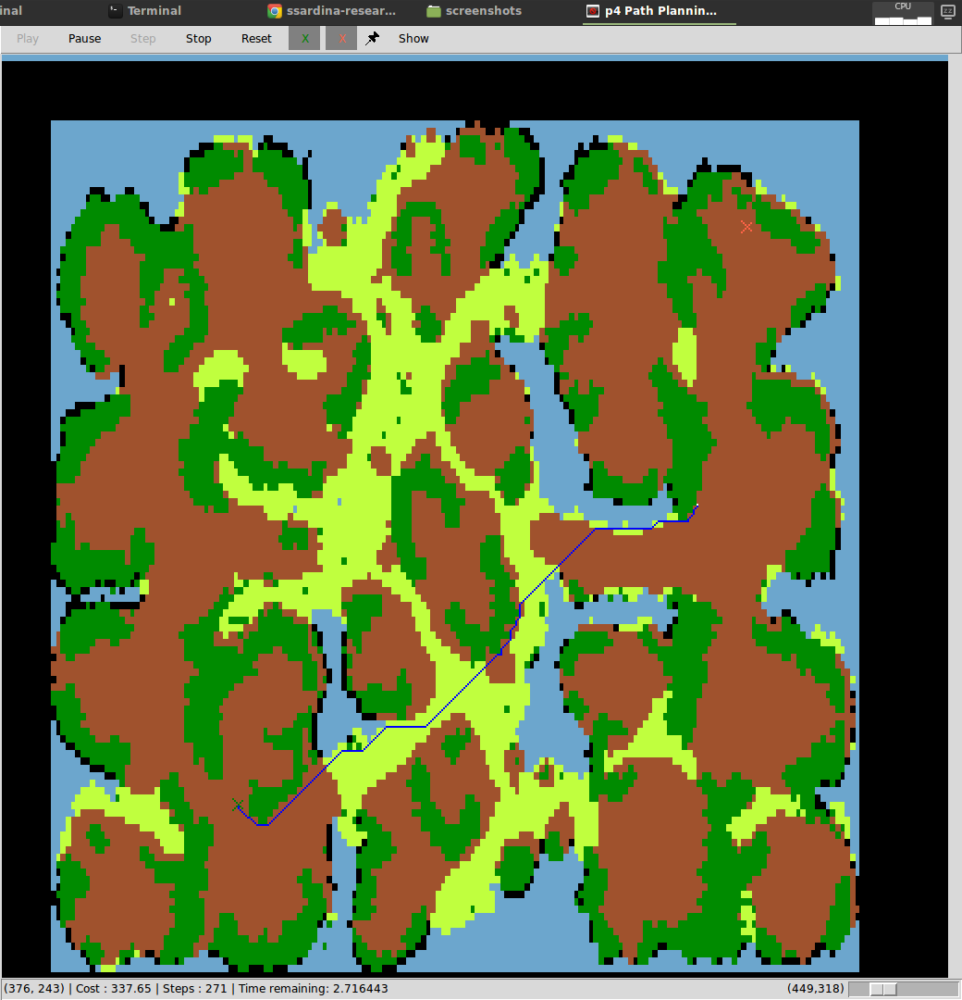
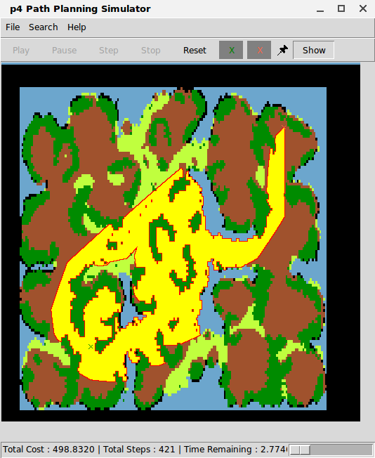
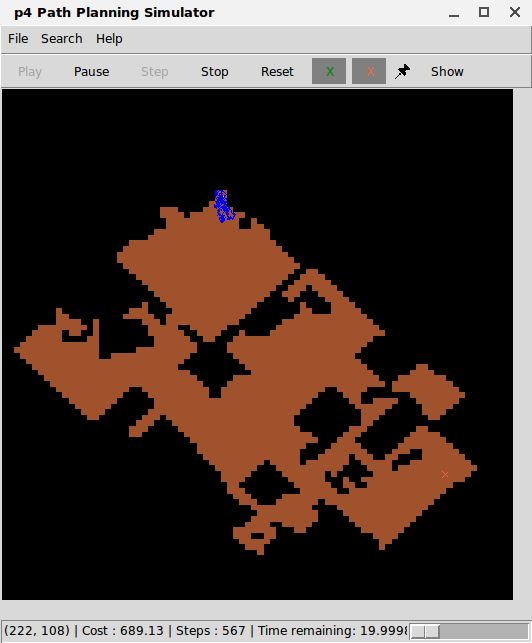

# p4 - Python Path Planning Project

**p4 (aka the "Python Path Planning Project** is a Python-based path planning framework and simulator, useful to prototype, evaluate, and benchmark path planning algorithms. 

The system began as a Python version of the Java-based [APPARATE path-planning simulator](https://github.com/ssardina-planning/apparate-simulator) to be able to prototype algorithms in a "lighter" programming language. It started as part of Peta Masters' 2013 programming course project and then extended to support her Honours thesis and doctorate program, under the supervision of A/Prof. Sebastian Sardina.

The p4 simulator relies on maps in the [Movingai](htpp://www.movingai.com) format. Run with GUI, to observe their operation, without GUI to obtain cost, steps and time-taken, or in auto mode to output `csv` files of accumulated results from map problems in `.scen` format (also from Movingai).

The p4 system has been used in the our [Goal Recognition in Path Planning AAMAS'17](https://dl.acm.org/citation.cfm?id=3091232) and the [Deception in Path Planning IJCAI'17](https://www.ijcai.org/proceedings/2017/610) papers. 

This [dedicated GR fork](https://github.com/ssardina-planning/p4-simulator-gr) of this repo for the extensions to p4 related to those works; check the sub-folders:

* For p4 in Goal Recognition in Path Planning see [here](https://github.com/ssardina-planning/p4-simulator-gr/tree/master/src/GR).
* For p4 in Deception in Path Planning see [here](https://github.com/ssardina-planning/p4-simulator-gr/tree/master/src/DPP).

Check some screenshots of p4: 
[screenshot 1](docs/screenshots/screenshot01.png) -
[screenshot 2](docs/screenshots/screenshot02.png) -
[screenshot 3](docs/screenshots/screenshot03.png) -
[screenshot 4](docs/screenshots/screenshot04.png)

-----------------------
- [p4 - Python Path Planning Project](#p4---python-path-planning-project)
  - [Prerequisites](#prerequisites)
  - [Features](#features)
  - [Director Structure](#director-structure)
  - [Configurations & Options](#configurations--options)
    - [Config file](#config-file)
    - [Cost model](#cost-model)
    - [Batch mode](#batch-mode)
  - [Examples](#examples)
  - [Interrogate Model Outside Simulator](#interrogate-model-outside-simulator)
  - [Batch and Profiling (Unix only)](#batch-and-profiling-unix-only)
  - [Technical Information](#technical-information)
  - [Contributors and Contact](#contributors-and-contact)
  - [License](#license)
  - [Screenshots](#screenshots)

## Prerequisites

* Python 2.7
* python-tk - Tkinter - Writing Tk applications with Python
* Map in [Movingai](htpp://www.movingai.com) with extensions for cost modeling.

## Features

* Run from CLI (for benchmarking) or with GUI interface (for visualisation and debugging).
* Compatible with [Movingai](htpp://www.movingai.com) map format with extensions for cost and dynamic changes (see below)
* Dynamic changes to map via map scripts (see below).
* Deadline specification (agent is terminated at deadline).
* Report of cost, steps, total and remaining time.
* Batch mode `-batch` for running group of scenarios (`.scen` format) and exporting stats to `csv` file.
* Different cost models: mixed, mixed-real, mixed-opt2.

## Director Structure

Supplied Files include:

* `docs/`: Documentation (not maintained beyond V2)
* `maps/`: Default map location
* `src/`: All source code for simulator
    * `src/agents/`:  Default agent location

## Configurations & Options

### Config file

`CFG_FILE`: Configuration file with all settings as Python variables and includes information such as what map and search algorithm to use. 

See `config.py` for expected format.

If `config_file` or file path not supplied, looks for default `config.py`.

### Cost model

This is the cost model when using mixed-cost grids:

* `mixed` (DEFAULT): one used in the contest using sqrt(2) for diagonals.
* `straight`: moves are 1*cost of destination.
* `diagonal`: moves are sqrt(2)*cost of destination.
* `mixed-real`: full center-to-center cost between source and destination cell.
* `mixed-opt1`: like mixed but optimized to 1.5.
* `straight`: moves are 1*cost of destination.
* `diagonal`: moves are 1.5*cost of destination.
* `mixed-opt2`: like mixed but optimized to 1.5*2.  

Straight moves are 2 x cost of destination

Diagonal moves are 3*cost of destination

### Batch mode

Batch mode, via `--batch`, allows to read and run problems from a `.scen` file and outputs results to the `OUT_FILE` in CSV format.

It can optionally take an integer `reps` for the number of repetitions across, which test times are to be averaged.

* The `<SCEN_FILE>` MUST be in [Movingai](https://movingai.com/benchmarks/mapf/index.html) scenario file format.  
* The map to be used must be in the same directory as the `<SCEN_FILE>` and its name is the prefix up to `.map` included. For example, if the `<SCEN_FILE>`  is `../maps/bgmaps/AR0011SR.map.aopd.scen`, then the map to be used will be file `../maps/bgmaps/AR0011SR.map`.
* The map names inside the `.scen` file will be ignored.

## Examples

All run from folder `src/`.

To see the options:

```bash
$ python p4.py --help
```

Run from customised config file and ASTAR in uniform cost with a deadline of 4 seconds:

```bash
$ python p4.py config.py
Total Cost : 510.416305603 | Total Steps : 440 | Time Remaining : 19.519 | Total Time : 0.48086

$ python p4.py
```

Run by providing a map, start and goal locations, deadline, and agent to use:

```shell
$ python p4.py -m ../maps/bloodvenomfalls.map -s 128,405 -g 403,93 -d 4 -a agent_astar
Total Cost : 498.8320 | Total Steps : 421 | Time Remaining : inf | Total Time : 1.258769
```

Interpreting the results:

* _`Total Cost`_: total cost of the solution path; costs may be non-uniform and diagonal moves cost more than straight moves
* _`Total Steps`_: number of steps that the path takes
* _`Time Remaining`_: time left to deadline given
* _`Total Time`_: time taken (Total Time + Time Remaining = Deadline)


Run the GUI with a random agent:

```shell
$ python p4.py -m AR0306SR.map  -s 218,110 -g 444,386 -a agent_random  -e euclid -d 20 -gui
```

Run with mixed cost:

```shell
$ python p4.py -m ../maps/bloodvenomfalls.map -c ../maps/mixedcost/G1-W5-S10.cost -s 128,405 -g 403,93 -a agent_astar
```

Run a BATCH of scenarios described in `AR0011SR.map.scen`, write results in file `astar_batch.csv`, each problem is run 3 times (and time averaged across):

```shell
$ python p4.py -batch ../maps/bgmaps/AR0011SR.map.scen astar_batch.csv 3 -a agent_astar
```

**Note:** if there's a difference between 'optimum' and astar 'actual', check SQRT2 definition in `p4_utils`.

Output is in CSV format: `cost;steps;time_taken;time_remaining`, e.g:

```csv
187.13708499;154;0.32759;19.672
```

## Interrogate Model Outside Simulator

In the `src/` directory run the Python interpreter:

```python
>>>import p4_model as m
>>>l = m.LogicalMap("../maps/mixedcost3.map")   #or other existing map
>>># now you can interrogate the model, e.g...
>>>l.getCost((0,0))                         #note double brackets
```

## Batch and Profiling (Unix only)

Profile a run:

* `-s time`: sorts by total time (without taking internal calls)
* `-s comulative`: sorts by cumulative time (taking all internal calls into account)

```shell
$ python -m cProfile p4.py -s time -m ../maps/AR0306SR.map  -s 218,110 -g 444,386 -a agent_astar -e euclid -d 20
```

Run it 10 times and get the average time:

```shell
$ run 10 /usr/bin/python  p4.py -m ../maps/AR0306SR.map  -s 218,110 -g 444,386 \
        -a agent_jps_inv -e euclid -d 20 | grep Cost | awk '{total += $19} END {print total/10}'
```

Function `run()` should be defined (e.g., in `.bashrc`) as follows:

```bash
run() {
    number=$1
    shift
    for i in `seq $number`; do
        bash $@
    done
}
```

## Technical Information

* By default, algorithms are timed using `time.clock()`. Switch to `time.time()` by resetting the global variable in `p4_utils.py`. 
* `p4_utils` also controls colors used to display returned lists. 
* `p4_utils.py` provides settings and `p4_model.py` presents an interface you can interrogate when implementing your own `agents/` algorithms. 
* if there's a difference between 'optimum' and astar 'actual', check SQRT2 definition in `p4_utils`.

## Contributors and Contact

* Peta Masters
* Sebastian Sardina

## License

This project is using the GPLv3 for open source licensing for information and the license visit GNU website (https://www.gnu.org/licenses/gpl-3.0.en.html).

This program is free software: you can redistribute it and/or modify it under the terms of the GNU General Public License as published by the Free Software Foundation, either version 3 of the License, or (at your option) any later version.

This program is distributed in the hope that it will be useful, but WITHOUT ANY WARRANTY; without even the implied warranty of MERCHANTABILITY or FITNESS FOR A PARTICULAR PURPOSE. See the GNU General Public License for more details.

You should have received a copy of the GNU General Public License along with this program. If not, see http://www.gnu.org/licenses/.

----------------------------

## Screenshots

Blue agent navigating to destination:



After arrival, area searched (closed list) is shown in yellow:



A random agent:



Use via terminal to do batch testing (many scenario problems in one map):

